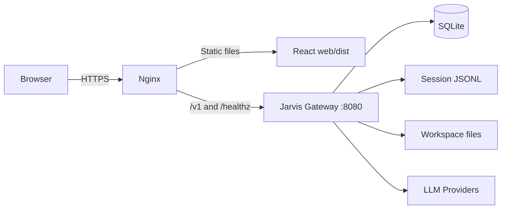

# JarvisServer 部署指南

本文说明如何部署 JarvisServer Gateway 与 Web 管理界面。当前推荐拓扑是：

当前 `web.alexuhui.win` 服务器的实际目录、systemd/Caddy 配置、数据位置和发布流程记录在
[`current-server-deployment.md`](current-server-deployment.md)。该文档描述现状；本文仍是推荐的
生产部署基线。



Nginx 对外提供 HTTPS、React 静态资源和 API 反向代理。Gateway 只监听
`127.0.0.1:8080`，使用 SQLite 保存账号、Token、Provider 配置、Chat 审计、
Provider 请求审计和 RunEvent。

## 1. 当前部署限制

部署前需要了解以下限制：

- 当前仅支持单 Gateway 实例。SQLite、JSONL 会话、运行中的 SSE 订阅、Task 状态和
  Provider 健康状态都位于本机或进程内，不能直接部署多个副本。
- Web 是纯静态应用，但 API 必须与 Gateway 使用同源地址，或通过反向代理解决跨域。
- Coder 模式会在服务器上执行文件和命令工具。生产环境必须使用专用系统账号，并限制
  `WorkspacesRoot` 的权限。
- Provider API Key 当前保存在 SQLite 中，数据库和备份必须按敏感数据保护。
- Claude OAuth 和 ASR 接口在未配置时会返回不可用。GitHub 支持 OAuth App 或用户级
  fine-grained PAT；OAuth 未配置时仍可从 Settings 使用 PAT。
- 仓库暂未提供官方 Dockerfile 或 Kubernetes 清单。本指南以 Linux 二进制部署为主。

### 1.1 部署构建门禁

任何部署都必须先通过：

```bash
go test ./internal/gateway ./cmd/gateway
```

构建、测试和 Web 生产打包由 `.github/workflows/ci.yml` 持续验证。生产配置仍应显式填写
`DatabasePath` 和 `AdminPassword`，避免部署环境差异影响数据位置和首次账号初始化。

## 2. 环境要求

推荐环境：

- Linux x86_64 或 arm64。
- Go 版本满足 `go.mod`。当前仓库声明 `go 1.27rc1`，建议启用 Go toolchain 自动选择。
- Node.js 20 或更高版本，以及 npm。
- Git 2.30 或更高版本（GitHub 仓库导入、Pull、Push 使用服务端 Git CLI）。
- Nginx 1.20 或更高版本。
- 可选：`sqlite3`，用于在线备份和诊断。
- 能访问所配置 LLM Provider 的出站网络。

服务器至少预留：

- 2 CPU、2 GiB RAM，复杂 Agent 任务建议 4 GiB 以上。
- 足够的 Workspace、会话和审计日志磁盘空间。
- HTTPS 域名和证书。

## 3. 构建产物

在 CI 或构建机中执行：

```bash
git clone https://github.com/alex6xu/JarvisServer.git
cd JarvisServer

go mod download
go test ./internal/gateway ./cmd/gateway
go build -trimpath -ldflags="-s -w" -o build/gateway ./cmd/gateway

cd web
npm ci
npm run build
cd ..
```

需要部署的产物为：

- `build/gateway`
- `web/dist/`
- `etc/gateway.yaml` 的生产版本

建议在 CI 中同时执行完整测试：

```bash
go test -buildvcs=false ./...
```

## 4. Linux 目录规划

以下示例使用独立的 `jarvis` 系统账号：

```bash
sudo useradd --system --home /var/lib/jarvis --shell /usr/sbin/nologin jarvis

sudo install -d -o root -g root -m 0755 /opt/jarvis/bin
sudo install -d -o root -g root -m 0755 /opt/jarvis/web
sudo install -d -o root -g jarvis -m 0750 /etc/jarvis
sudo install -d -o jarvis -g jarvis -m 0700 /var/lib/jarvis/data
sudo install -d -o jarvis -g jarvis -m 0700 /var/lib/jarvis/home
sudo install -d -o jarvis -g jarvis -m 0700 /var/lib/jarvis/workspaces
```

安装构建产物：

```bash
sudo install -o root -g root -m 0755 build/gateway /opt/jarvis/bin/gateway
sudo cp -a web/dist/. /opt/jarvis/web/
sudo chown -R root:root /opt/jarvis/web
```

目录职责：

| 路径 | 内容 | 建议权限 |
|---|---|---|
| `/opt/jarvis/bin` | Gateway 二进制 | `root:root 0755` |
| `/opt/jarvis/web` | React 静态文件 | `root:root 0755` |
| `/etc/jarvis` | Gateway 配置 | `root:jarvis 0750` |
| `/var/lib/jarvis/data` | SQLite 数据库 | `jarvis:jarvis 0700` |
| `/var/lib/jarvis/home` | Jarvis 用户级配置、会话等 | `jarvis:jarvis 0700` |
| `/var/lib/jarvis/workspaces` | Coder Workspace | `jarvis:jarvis 0700` |

## 5. 生产配置

创建 `/etc/jarvis/gateway.yaml`：

```yaml
Name: gateway
Host: 127.0.0.1
Port: 8080
Timeout: 0
Mode: pro

Log:
  Mode: console
  Level: info

Middlewares:
  # Chat 使用 SSE，不能应用普通短请求超时。
  Timeout: false

Agent:
  Cwd: /var/lib/jarvis
  # 生产环境必须使用 Token 认证。
  AuthMode: token

  # 仅在数据库中还没有账号时用于创建第一个 dev 管理员。
  # 首次登录后立即修改密码，然后可从配置中移除此项。
  AdminPassword: "REPLACE_WITH_A_LONG_RANDOM_PASSWORD"

  # 默认关闭匿名自助注册。管理员仍可在账号管理页面创建用户。
  AllowRegistration: false

  WorkspacesRoot: /var/lib/jarvis/workspaces
  DatabasePath: /var/lib/jarvis/data/gateway.db

  AuditRetentionDays: 30
  AuditMaxBodyBytes: 1048576
  RunTimeoutSeconds: 1800

  # false：不自动授予命令、写文件等副作用工具的信任。
  # 需要无人值守运行 Coder 时，只能在隔离良好的专用 Workspace 中谨慎设为 true。
  Approve: false
  NoTools: false
  NoSkills: false

  # 可选的启动级兜底 Provider。通常建议启动后在管理界面配置 Provider。
  # ProviderName: openrouter
  # APIKey: ""
  # BaseURL: ""
  # Protocol: ""

  # APIToken 是共享管理员 Token，泄露后权限很大。通常留空并使用账号/API Token。
  # APIToken: ""

# 可选。未配置 OAuth 时，用户仍可在 Settings 中连接 fine-grained PAT。
GitHub:
  ClientID: "REPLACE_WITH_GITHUB_OAUTH_CLIENT_ID"
  ClientSecret: "REPLACE_WITH_GITHUB_OAUTH_CLIENT_SECRET"
  RedirectURL: "https://jarvis.example.com/v1/github/callback"
  Scopes: "repo read:user"
  GitTimeoutSecs: 300

  # 建议通过 GITHUB_TOKEN_KEY 环境变量注入。若留空，Gateway 会生成
  # /var/lib/jarvis/.jarvis/github-token.key（路径相对于 Agent.Cwd）。
  # TokenKey: "REPLACE_WITH_A_LONG_RANDOM_SECRET"

MarketData:
  BinanceWSURL: "wss://data-stream.binance.vision/stream"
  OKXWSURL: "wss://ws.okx.com:8443/ws/v5/public"
  BinanceRESTURL: "https://data-api.binance.vision"
  OKXRESTURL: "https://www.okx.com"
  # 美股舆情可选配置。密钥建议通过 systemd 环境变量提供。
  StockSentimentAPIURL: "https://api.adanos.org"
  StockSentimentCacheTTLSeconds: 86400
  NewsSentiment:
    CacheTTLSeconds: 1800
    MaxResults: 12
    Anspire:
      APIURL: "https://plugin.anspire.cn/api/ntsearch/search"
    Tavily:
      APIURL: "https://api.tavily.com/search"
    Bocha:
      APIURL: "https://api.bocha.cn/v1/web-search"
    Brave:
      APIURL: "https://api.search.brave.com/res/v1/web/search"
```

启用 Reddit、X 和 Polymarket 美股舆情时，在 Gateway 服务环境中设置：

```ini
Environment=SOCIAL_SENTIMENT_API_KEY=REPLACE_WITH_API_KEY
# 可选；默认 https://api.adanos.org
Environment=SOCIAL_SENTIMENT_API_URL=https://api.adanos.org
```

新闻舆情至少配置一个搜索 Provider；支持逗号分隔的多 Key，当前 Key 失败时会自动尝试
下一个：

```ini
Environment=ANSPIRE_API_KEYS=REPLACE_WITH_API_KEY
# 以下来源均为可选
Environment=TAVILY_API_KEY=REPLACE_WITH_API_KEY
Environment=BOCHA_API_KEYS=REPLACE_WITH_API_KEY
Environment=BRAVE_API_KEY=REPLACE_WITH_API_KEY
```

启用自定义 Skill 和内置 `stock-latest-digest` 时，为 Gateway 配置一个可写、不可被
Web 直接访问的目录：

```ini
Environment=JARVIS_SKILLS_DIR=/var/lib/jarvis/skills
```

```bash
sudo install -d -o jarvis -g jarvis -m 0750 /var/lib/jarvis/skills
```

同时保持 `Agent.NoSkills: false`。Gateway 启动时会安装缺失的内置 Skill，并在
Settings 中提供管理员编辑、校验、启停和 Reload。普通账号只能启停已发布 Skill。
Skill 文件不能保存 API Key；密钥继续通过服务环境或 Gateway 的加密配置提供。

股票摘要还会自动创建 `skills`、`account_skills`、`watchlist_items` 和
`notification_deliveries` 表。无需手工执行 SQL；升级前仍应先备份 SQLite 数据库。

舆情接口会把 `AAPL`、`AAPL.US`、`US:AAPL` 和东财 `105.AAPL` 等形式统一为
`AAPL`。默认缓存 24 小时，以控制第三方免费额度消耗；上游不可用时会回退 SQLite
中最近一次快照并标记为过期。详细说明见 [`stock-sentiment.md`](stock-sentiment.md)。

保护配置：

```bash
sudo chown root:jarvis /etc/jarvis/gateway.yaml
sudo chmod 0640 /etc/jarvis/gateway.yaml
```

注意：

- `AdminPassword` 只负责首次初始化。数据库已有管理员后，修改配置不会重置密码。
- `AllowRegistration` 默认是 `false`；仅在确实需要开放自助注册时临时设为 `true`。
- 不要把真实 API Key 提交到 Git。
- 如果通过管理界面配置 Provider，Key 会写入 SQLite，应保证数据库权限为 `0600`。
- `AuditRetentionDays` 小于 0 时可禁用启动清理；生产环境不建议无限保留审计正文。
- `AuditMaxBodyBytes` 限制单个 Provider 请求或响应的审计体积，不限制 Workspace 上传大小。
- `RunTimeoutSeconds` 限制单次 Agent Run 的总时长；设为负数可禁用，生产环境建议保留有限超时。

### 5.1 GitHub 连接

GitHub 有两种连接方式：

1. OAuth App：管理员在 GitHub 创建 OAuth App，将 Authorization callback URL 设置为
   `https://<部署域名>/v1/github/callback`，再配置 `ClientID`、`ClientSecret` 和完全一致的
   `RedirectURL`。用户可在 Settings 或 Code 页完成授权。
2. Fine-grained PAT：用户在 Settings 粘贴 Token。Token 至少需要选中目标仓库，并授予
   Repository permissions → Contents: Read and write。仅导入不 Push 时可只授予 Read。

Gateway 会先调用 GitHub `/user` 验证凭据，再使用 AES-GCM 加密写入 SQLite。响应、请求日志和
Workspace 的 `.git/config` 都不会保存明文 Token。自动生成的 `github-token.key` 必须与
`gateway.db` 一同备份；密钥丢失后，已有 GitHub 连接无法解密，只能由用户重新连接。

也可通过环境变量配置，适合 systemd `EnvironmentFile`：

```bash
GITHUB_CLIENT_ID=...
GITHUB_CLIENT_SECRET=...
GITHUB_REDIRECT_URL=https://jarvis.example.com/v1/github/callback
GITHUB_TOKEN_KEY=replace-with-a-long-random-secret
```

GitHub 仓库以浅克隆导入，仍受 `WorkspaceMaxBytes`、`WorkspaceMaxFileBytes` 和文件数量限制。
Pull 只允许 fast-forward，并在工作区有未提交修改时拒绝执行；Push 会提交当前修改后推送到
绑定分支。服务端会固定使用绑定仓库地址，并禁用凭据助手和 Git hooks，防止工作区修改 Git
配置后转移凭据。

## 6. systemd 服务

创建 `/etc/systemd/system/jarvis-gateway.service`：

```ini
[Unit]
Description=Jarvis Gateway
After=network-online.target
Wants=network-online.target

[Service]
Type=simple
User=jarvis
Group=jarvis
WorkingDirectory=/var/lib/jarvis
Environment=JARVIS_HOME=/var/lib/jarvis/home
ExecStart=/opt/jarvis/bin/gateway -f /etc/jarvis/gateway.yaml
Restart=on-failure
RestartSec=3
TimeoutStopSec=30
UMask=0077

NoNewPrivileges=true
PrivateTmp=true
ProtectSystem=strict
ProtectHome=true
ReadWritePaths=/var/lib/jarvis

[Install]
WantedBy=multi-user.target
```

启用服务：

```bash
sudo systemctl daemon-reload
sudo systemctl enable --now jarvis-gateway
sudo systemctl status jarvis-gateway
sudo journalctl -u jarvis-gateway -f
```

检查数据库权限：

```bash
sudo chown jarvis:jarvis /var/lib/jarvis/data/gateway.db
sudo chmod 0600 /var/lib/jarvis/data/gateway.db
```

如果启用 Agent 的 Bash 工具，systemd 沙箱只限制文件系统边界，并不等同于完整容器隔离。
高风险或多租户环境应使用独立 Worker、容器或虚拟机运行 Agent Runtime。

## 7. Nginx 与 HTTPS

创建 `/etc/nginx/sites-available/jarvis`：

```nginx
server {
    listen 80;
    server_name jarvis.example.com;

    root /opt/jarvis/web;
    index index.html;

    # Match Agent.WorkspaceUploadMaxBytes (100 MiB by default), plus multipart overhead.
    # Must exceed the 100 MiB ZIP limit because multipart adds framing bytes.
    client_max_body_size 110m;

    location = /healthz {
        proxy_pass http://127.0.0.1:8080;
        proxy_http_version 1.1;
        proxy_set_header Host $host;
        proxy_set_header X-Forwarded-For $proxy_add_x_forwarded_for;
        proxy_set_header X-Forwarded-Proto $scheme;
    }

    location /v1/ {
        proxy_pass http://127.0.0.1:8080;
        proxy_http_version 1.1;
        proxy_set_header Host $host;
        proxy_set_header X-Real-IP $remote_addr;
        proxy_set_header X-Forwarded-For $proxy_add_x_forwarded_for;
        proxy_set_header X-Forwarded-Proto $scheme;

        # Agent 事件使用 SSE。禁用缓冲并延长读取时间。
        proxy_buffering off;
        proxy_cache off;
        proxy_read_timeout 3600s;
        proxy_send_timeout 3600s;
        gzip off;
    }

    location / {
        try_files $uri $uri/ /index.html;
    }
}
```

启用并检查配置：

```bash
sudo ln -s /etc/nginx/sites-available/jarvis /etc/nginx/sites-enabled/jarvis
sudo nginx -t
sudo systemctl reload nginx
```

生产环境必须配置 TLS。可以使用组织证书，或通过 Certbot 配置：

```bash
sudo certbot --nginx -d jarvis.example.com
```

防火墙只开放 `80/443`，不要对公网开放 `8080`。

## 8. 首次启动

健康检查：

```bash
curl --fail http://127.0.0.1:8080/healthz
curl --fail https://jarvis.example.com/healthz
```

首次登录使用：

- 用户名：`dev`
- 密码：配置中的首次 `AdminPassword`

登录后应立即：

1. 修改管理员密码。
2. 在管理界面添加 Provider，并填写 Base URL、模型、权重和优先级。
3. 使用“获取模型”和“路由预览”验证 Provider。
4. 创建日常使用的 API Token，不长期使用共享 `APIToken`。
5. 发起一次 Chat 和一次 Coder 请求，确认请求日志与 RunEvent 已写入 SQLite。

可直接验证登录 API：

```bash
curl -sS https://jarvis.example.com/v1/auth/login \
  -H 'Content-Type: application/json' \
  -d '{"username":"dev","password":"YOUR_PASSWORD"}'
```

## 9. SQLite 备份与恢复

数据库默认包含敏感信息。备份文件必须加密并限制访问。

推荐使用 SQLite 在线备份：

```bash
sudo -u jarvis sqlite3 /var/lib/jarvis/data/gateway.db \
  ".backup '/var/lib/jarvis/data/gateway-backup.db'"
```

随后将备份文件复制到受保护的备份系统。不要只在服务运行时复制单个 `.db` 文件，WAL
模式下还可能存在 `gateway.db-wal` 和 `gateway.db-shm`。

恢复步骤：

```bash
sudo systemctl stop jarvis-gateway
sudo install -o jarvis -g jarvis -m 0600 gateway-backup.db \
  /var/lib/jarvis/data/gateway.db
sudo systemctl start jarvis-gateway
```

除 SQLite 外，还应备份：

- `/var/lib/jarvis/home` 中的会话、插件和配置。
- `/var/lib/jarvis/workspaces` 中需要保留的项目文件。
- `/etc/jarvis/gateway.yaml`，建议使用独立 Secret 管理系统保存其中的秘密。

## 10. 升级与回滚

升级前：

1. 备份 SQLite、会话和 Workspace。
2. 在 CI 中通过 Gateway、CLI 和 Web 构建测试。
3. 记录当前二进制和 Web 产物版本。

升级：

```bash
sudo systemctl stop jarvis-gateway
sudo install -o root -g root -m 0755 build/gateway /opt/jarvis/bin/gateway.next
sudo install -d -o root -g root -m 0755 /opt/jarvis/web.next
sudo cp -a web/dist/. /opt/jarvis/web.next/
sudo mv /opt/jarvis/bin/gateway /opt/jarvis/bin/gateway.previous
sudo mv /opt/jarvis/bin/gateway.next /opt/jarvis/bin/gateway
sudo mv /opt/jarvis/web /opt/jarvis/web.previous
sudo mv /opt/jarvis/web.next /opt/jarvis/web
sudo systemctl start jarvis-gateway
curl --fail http://127.0.0.1:8080/healthz
```

执行下一次升级前，应先归档或移走 `.previous` 目录和文件，避免覆盖最后一个可回滚版本。

SQLite 表会在 Gateway 启动时自动创建。升级代码在未来可能增加不可逆迁移，因此回滚二进制前应
同时评估数据库兼容性；最可靠的回滚方式是恢复升级前的数据库备份与对应产物。

## 11. 开发环境启动

开发时分别启动 Gateway 和 Vite：

```bash
# 终端 1
go run ./cmd/gateway -f etc/gateway.yaml

# 终端 2
cd web
VITE_GATEWAY_TARGET=http://127.0.0.1:8080 npm run dev -- --host 127.0.0.1
```

默认访问：

- Web：`http://127.0.0.1:3000`
- Gateway：`http://127.0.0.1:8080`
- 健康检查：`http://127.0.0.1:8080/healthz`

Windows PowerShell：

```powershell
go build -o build\gateway.exe .\cmd\gateway
cd web
npm ci
npm run build
cd ..
.\build\gateway.exe -f .\etc\gateway.yaml
```

Windows 长期运行可使用 Windows Service 包装器或任务计划程序；应使用低权限专用账号，
并在 IIS/Nginx/Caddy 中统一托管 `web/dist` 和反向代理 `/v1`。

## 12. 运维检查表

每次发布至少确认：

- Gateway 只监听回环地址，公网只开放 HTTPS。
- `AuthMode` 为 `token`，没有启用匿名模式。
- 管理员密码与 API Token 已轮换，没有写入 Git 或日志。
- SQLite、配置和备份权限正确。
- Nginx 对 `/v1` 禁用了代理缓冲，SSE 长连接不会被短超时中断。
- Workspace 目录不包含宿主机敏感文件，也没有挂载 Docker Socket 等高权限资源。
- Provider 路由预览符合预期，故障 Provider 能被熔断并安全切换。
- Chat 与 Provider 请求日志可查询，审计保留期符合组织要求。
- SQLite、会话和 Workspace 备份可以实际恢复。
- 磁盘空间、Gateway 日志、Provider 错误率和请求延迟受到监控。
