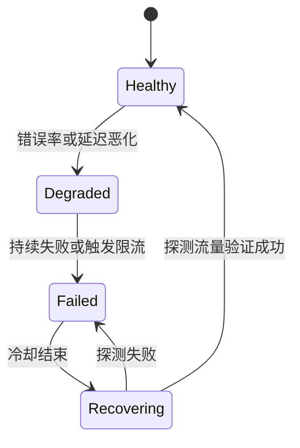
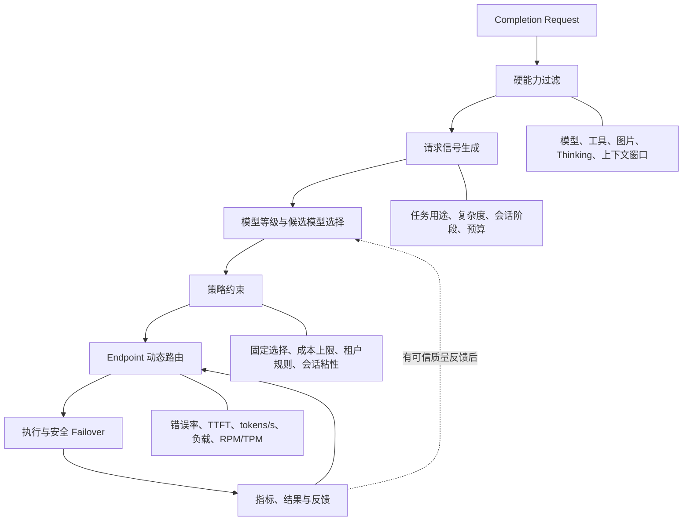
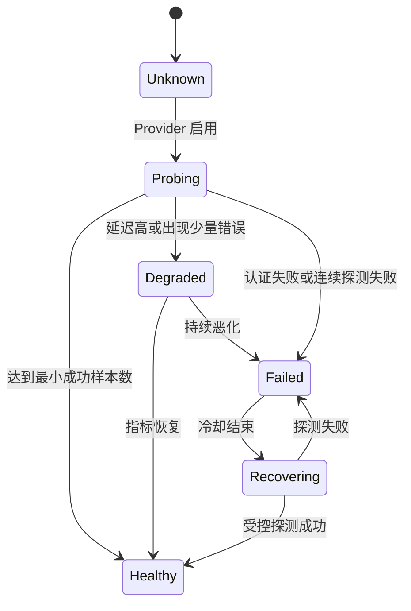

# LLM Provider 智能路由方案调研

> 调研日期：2026-08-19  
> 适用项目：JarvisServer Gateway

## 1. 背景与目标

JarvisServer 已经支持多 Provider、按模型和能力过滤、策略评分、熔断，以及在首个有效输出前进行故障切换。当前实现主要位于：

- `internal/router/engine.go`：候选过滤、评分、排序和健康状态更新。
- `internal/gateway/route_planner.go`：将 Provider 配置转换为路由端点，并按任务用途生成策略。
- `internal/gateway/failover_provider.go`：逐 Turn 规划候选，在输出提交前执行安全切换。

现有实现属于规则驱动的 Provider 路由。进一步提升智能程度，需要分别解决两个不同问题：

1. **执行路由**：同一模型有多个 Provider 或 Endpoint 时，选择当前最可靠、最快、最便宜且负载合理的线路。
2. **模型路由**：根据请求内容、难度和能力要求，决定使用哪个模型或模型等级。

这两类问题不应混为一个评分公式。推荐先选择模型等级和能力需求，再在满足要求的 Provider 中执行健康路由。

## 2. 项目概览

GitHub 热度为调研日期查询到的近似值，会随时间变化。

| 项目 | GitHub 热度 | 类型 | 核心能力 | 对 JarvisServer 的参考价值 |
|---|---:|---|---|---|
| [LiteLLM](https://github.com/BerriAI/litellm) | 约 56.7k stars | 通用 LLM Gateway | 部署组负载均衡、配额感知、重试、冷却和分层 Fallback | 很高 |
| [Portkey Gateway](https://github.com/Portkey-AI/gateway) | 约 12.8k stars | 配置驱动 Gateway | 条件路由、嵌套负载均衡、错误触发的 Fallback、Guardrail | 高 |
| [TensorZero](https://github.com/tensorzero/tensorzero) | 约 11.7k stars | Gateway + LLMOps | 观测、评测、A/B 测试、自适应实验和反馈闭环 | 中长期很高 |
| [Bifrost](https://github.com/maximhq/bifrost) | 约 7.4k stars | 高性能 Gateway | 自适应权重、健康状态机、Provider/Key 两级选择 | 很高 |
| [RouteLLM](https://github.com/lm-sys/RouteLLM) | 约 5.4k stars | 强弱模型路由 | 预测请求是否需要强模型，用阈值控制成本与质量 | 中期较高 |
| [vLLM Semantic Router](https://github.com/vllm-project/semantic-router) | 约 5.2k stars | 语义 Mixture-of-Models | 按意图、复杂度、工具需求选择模型或 LoRA | 中期较高 |

## 3. 成熟 Gateway 的实现方式

### 3.1 LiteLLM：部署组、配额感知与分层 Fallback

LiteLLM 将多个真实部署映射为同一个逻辑模型组。例如一个 `coder` 模型组可以同时包含 OpenAI、Azure 和 Bedrock 上的部署。请求先选择逻辑模型，再在模型组内选择具体部署。

其常见路由策略包括：

- 按权重随机选择。
- 选择当前并发较少的部署。
- 根据近期延迟进行加权选择。
- 根据 RPM/TPM 使用量和剩余额度选择。
- 使用 `order` 表达主备层级。
- 针对普通错误、上下文溢出和内容策略错误设置不同 Fallback。

生产部署可以通过 Redis 在多个 Gateway 实例之间共享冷却状态、配额使用和调用统计。请求内发生可重试失败后，失败部署会进入本次请求的排除集合；路由器优先重选同一模型组中的其他部署，组内候选耗尽后再进入跨模型 Fallback。

值得借鉴的设计：

- 健康状态至少细化到 `provider + model`，避免单个不可用模型拖垮整个 Provider。
- 同模型、不同区域或 Key 的切换优先于跨模型切换。
- 将 RPM、TPM、`Retry-After` 和并发数作为实时路由信号。
- 不同错误进入不同的重试、冷却或 Fallback 路径。

参考：[LiteLLM Router 文档](https://docs.litellm.ai/docs/routing)

### 3.2 Portkey：可组合的配置路由树

Portkey 使用声明式配置组合路由行为。一个目标既可以是 Provider，也可以是另一个负载均衡或 Fallback 组，因此可以表达如下结构：

```text
主 Provider
  ├─ 失败后指数退避重试
  ├─ 429 -> 备用 Provider 组
  ├─ 5xx -> 跨云负载均衡组
  └─ 全部失败 -> 降级模型
```

其路由配置可以组合：

- Weighted load balancing。
- 按优先级执行的 Fallback。
- 按 HTTP 状态码决定是否切换。
- 每个目标或整条路径的超时。
- 输入、输出 Guardrail。
- 根据请求属性执行条件路由。

Portkey 的优势是策略表达力强，但任意嵌套也会增加验证、循环检测、可观测性和调试成本。JarvisServer 可以先支持有限的条件规则和线性 Fallback，不宜直接引入无限嵌套 DSL。

参考：[Portkey Gateway](https://github.com/Portkey-AI/gateway)

### 3.3 Bifrost：动态权重与恢复状态机

Bifrost 的自适应负载均衡与 JarvisServer 当前评分路由最接近。其公开文档描述了周期性重算权重的机制，主要信号为：

1. 近期错误率。
2. 相对其他线路的延迟，以及相对自身历史基线的延迟。
3. 当前利用率。

线路在以下状态间转换：



动态权重用于概率选择，而不是始终选择最高分线路。低权重线路仍保留少量探测流量，因此恢复后的 Provider 可以逐步重新获得流量，避免熔断到期后瞬间承受完整流量。

Bifrost 还区分：

- Provider 选择：决定使用哪一家上游。
- Key/Endpoint 选择：在同一 Provider 的多个凭据或区域中选择。

需要注意，自适应负载均衡的部分能力在 Bifrost 文档中位于 Enterprise 目录。其设计思想可以参考，但采用前应单独确认具体代码的开源范围和许可证。

参考：[Bifrost Adaptive Load Balancing](https://github.com/maximhq/bifrost/blob/dev/docs/enterprise/adaptive-load-balancing.mdx)

### 3.4 TensorZero：从请求成功扩展到结果质量

传统 Gateway 主要观测请求是否成功，而 TensorZero 把推理结果、用户反馈和离线评测纳入闭环：


Variant 可以代表模型、Provider、Prompt 和参数的组合。系统通过数据集评测、启发式指标、LLM Judge、用户反馈和自适应实验比较不同 Variant。

该方案的关键前提是存在可信的质量反馈。没有反馈数据时，自适应算法只能优化成功率、延迟和成本，无法真正优化回答质量。JarvisServer 应先建立 `route decision -> task result -> feedback` 的关联，再考虑 Thompson Sampling 或其他 Bandit 算法。

参考：[TensorZero](https://github.com/tensorzero/tensorzero)

## 4. 语义模型路由的实现方式

### 4.1 RouteLLM：强模型与弱模型二选一

RouteLLM 的目标是预测一个请求是否值得调用昂贵的强模型。基本流程为：

```text
Prompt -> 特征或 Embedding -> 路由模型 -> 强模型概率 -> 阈值判断
```

项目提供相似度加权、矩阵分解、BERT 分类器和 LLM 分类器等 Router。阈值用于控制强模型调用比例，从而调节成本与质量。

这种方案适用于高频、任务分布相对稳定、强弱模型差距明确的场景。对代码 Agent 而言，需要额外考虑：

- 多轮上下文，而不只是最后一条 Prompt。
- 工具调用和结构化输出能力。
- 当前任务阶段，例如分析、执行或压缩。
- 上下文窗口、图片和 Thinking 等硬能力。

因此 RouteLLM 更适合作为“模型等级建议器”，不应直接替代 Provider 健康路由。

参考：[RouteLLM](https://github.com/lm-sys/RouteLLM)

### 4.2 vLLM Semantic Router：多信号的 Mixture-of-Models

vLLM Semantic Router 将路由看作模型池级别的 Mixture-of-Models。它可以从请求中产生意图、任务类别、复杂度、工具需求和安全相关信号，再选择模型或 LoRA Adapter。

推荐借鉴其“信号与决策分离”思想：

```text
请求
  -> 能力与安全硬过滤
  -> 意图/复杂度/工具需求信号
  -> 选择模型等级或候选集合
  -> Provider 健康与负载路由
```

对于连接第三方 API Provider 的 JarvisServer，没有必要引入完整的本地推理栈。可以先用规则或轻量分类器产生路由信号，再交给现有 Go Router 执行。

参考：[vLLM Semantic Router](https://github.com/vllm-project/semantic-router)

## 5. JarvisServer 当前差距

当前实现已经具备良好的基础，但存在以下限制：

### 5.1 Priority 对评分影响过强

当前评分包含 `Priority * 100`。当不同 Provider 的 Priority 相差 1 时，健康、延迟、成本和质量指标通常很难改变最终顺序，导致动态指标退化为次要的平分规则。

建议将 Priority 改为层级过滤，或限制为较小的归一化偏置：先在最高可用层级中动态路由，该层全部不可用时再进入下一层。

### 5.2 延迟指标并非真实 P95

现有 `LatencyP95Ms` 更新逻辑是慢样本直接覆盖、较快样本缓慢衰减，并非统计意义上的 P95。建议采用固定时间窗口直方图，或者分别维护 EWMA：

- 首 Token 延迟 TTFT。
- 总请求延迟。
- 输出吞吐量 tokens/s。

流式交互通常更应关注 TTFT 和 tokens/s，而不是只关注请求总耗时。

### 5.3 ActiveLoad 尚未形成闭环

路由类型已经声明 `ActiveLoad`，评分公式也会扣除负载分，但 Provider 转换过程中没有填充真实并发数，因此 `LoadWeight` 当前不能发挥作用。

### 5.4 错误惩罚缺乏差异

认证错误、限流、超时和普通上游错误最终都会增加连续失败次数。建议区分：

| 错误类型 | 推荐行为 |
|---|---|
| `401/403` | 停用对应凭据，等待配置修复 |
| `429` | 读取 `Retry-After`，按 Provider 或 Key 临时避让 |
| 超时、连接失败 | 指数退避并熔断 Endpoint |
| `5xx` | 短期降权，持续失败后熔断 |
| 模型不存在 | 仅排除 `Endpoint + Model` |
| 上下文溢出 | 切换到更大上下文模型，不惩罚 Provider |
| 内容策略拒绝 | 按策略切换模型，不计入基础设施健康度 |
| 用户取消 | 不惩罚 Provider |

### 5.5 缺少恢复探测和会话粘性

当前熔断到期后线路直接重新进入正常候选集合。建议引入 Half-open/Recovering 状态并限制探测并发。同时对同一 Session 上一次成功的 Endpoint 提供有限加分，以减少跨 Provider 重放时的工具调用和消息格式差异。

## 6. 推荐目标架构



建议保持职责边界：

- **Signal Provider**：只解析请求并产生任务类型、复杂度和能力需求。
- **Model Selector**：选择模型等级或候选模型，不处理网络健康。
- **Endpoint Router**：在候选模型对应 Endpoint 中根据实时指标选择线路。
- **Failover Executor**：执行请求内重试和安全切换，不重新解释业务策略。
- **Feedback Collector**：将执行指标和质量结果关联回路由决策。

## 7. 分阶段落地建议

### Phase 1：完善可靠性信号

优先级最高，无需机器学习。

- 健康键从 Endpoint 扩展到 `Endpoint + Model`。
- 分离 TTFT、总延迟和 tokens/s 指标。
- 使用时间窗口或 EWMA，修正伪 P95。
- 接入真实 ActiveLoad，并确保开始、完成、取消时计数对称。
- 细化错误分类和各类冷却策略。
- 支持 `Retry-After`、RPM 和 TPM 信号。

### Phase 2：自适应 Endpoint 路由

- 将 `Healthy / Degraded / Failed / Recovering` 状态机引入 Router。
- 每隔固定周期基于时间衰减指标计算动态权重。
- 在同一 Priority 层内按动态权重随机抽取，而不是永远选择最高分。
- 为 Recovering 线路保留少量探测流量。
- 增加 Session Affinity，但健康和能力硬条件始终优先。

### Phase 3：模型级策略路由

- 保留现有 `RoutePurpose`，扩展复杂度、预算和所需能力信号。
- 先用可解释规则将请求映射为 `economy / standard / premium` 模型等级。
- 建立路由预览，显示硬过滤结果、每项分数、最终随机权重和选择原因。
- 用 Shadow Mode 记录“智能路由本会选择什么”，但不真正切换流量。

### Phase 4：反馈驱动优化

- 关联 Route Decision、Run Attempt、工具执行结果和用户反馈。
- 建立代码任务成功率、结构化输出有效率和用户评价等质量指标。
- 在离线回放中评估 Router，达到门槛后再上线少量探索流量。
- 从简单的 epsilon-greedy 或 Thompson Sampling 开始，不直接引入复杂在线学习。

## 8. 推荐的动态评分方式

硬条件应先过滤，评分只比较合格候选。所有指标需归一化到稳定范围：

```text
score =
    health_score       * health_weight
  + quality_score      * quality_weight
  + affinity_score     * affinity_weight
  - ttft_score         * latency_weight
  - throughput_penalty * latency_weight
  - cost_score         * cost_weight
  - load_score         * load_weight
  - cooldown_penalty
```

不建议直接取最高分。可将 Score 转换成概率权重：

```text
weight_i = max(min_probe_weight, exp(score_i / temperature))
```

其中 `temperature` 控制探索程度。固定 Provider、合规限制和硬预算属于约束，不应仅表现为可被其他分数抵消的加减项。

## 9. 创建 Provider 时不定义权重

Provider 创建时不要求用户填写默认权重是可行的，而且更适合作为 JarvisServer 的默认行为。静态配置只描述线路的事实和约束，例如模型、能力、上下文窗口、成本和认证信息；实际流量权重由 Router 根据运行数据动态计算。

需要区分三类概念：

| 概念 | 来源 | 作用 |
|---|---|---|
| Priority | 管理员或策略配置 | 表达主备层级，不参与同层细粒度流量计算 |
| BaseWeight | 可选的管理员配置 | 表达长期业务偏好，不代表最终流量比例 |
| EffectiveWeight | Router 运行时计算 | 决定当前请求的实际选择概率 |

在完全自动模式下不需要 `BaseWeight`，所有新 Provider 从相同的中性先验开始。若以后需要人工干预，可以把 BaseWeight 作为动态权重的乘数，而不是覆盖健康判断。

### 9.1 动态权重来源

每个 `Endpoint + Model` 维护以下运行指标：

```text
success_rate
error_rate
ttft_ewma
latency_ewma
tokens_per_second
active_requests
rate_limit_until
health_state
sample_count
```

动态权重可以采用乘法模型：

```text
effective_weight =
    base_factor
  * health_factor
  * latency_factor
  * throughput_factor
  * load_factor
  * rate_limit_factor
  * recovery_factor
```

各因子需设置上下限，避免单项噪声无限放大：

```text
health_factor      = 0.1 ~ 1.0
latency_factor     = 0.2 ~ 1.0
throughput_factor  = 0.5 ~ 1.5
load_factor        = 0.1 ~ 1.0
rate_limit_factor  = 0 或 1
recovery_factor    = 0.05 ~ 1.0
```

`base_factor` 在自动模式下固定为 `1`。若启用人工偏好，则取经过限制的 BaseWeight。认证失败、合规禁止和能力不匹配属于硬排除条件，不应只把权重降低到接近零。

动态权重是派生状态，不应作为 Provider 配置持久化。系统可以缓存最近一次计算结果用于管理界面展示和多实例同步，但事实来源仍应是原始或聚合运行指标。

### 9.2 新 Provider 冷启动

没有历史样本的新 Provider 不能使用零权重，否则它永远无法得到请求，也无法建立健康数据。推荐采用乐观但受控的冷启动：



建议的初始规则：

- 新 Provider 使用中等初始权重，但最大并发限制为 `1`。
- 前几个请求只作为探测流量，不立即承担正常比例流量。
- 累积最小成功样本后进入正常动态路由。
- `401/403` 立即进入 Failed，等待凭据或配置修复。
- `429` 按 `Retry-After` 暂停探测，不视为永久失败。
- Recovering 状态只获得少量流量，连续成功后逐步恢复完整权重。

冷启动阈值需要通过实际流量校准。首版可以使用简单配置，例如最少 `3` 次成功进入受限健康状态，累计 `10` 至 `20` 个样本后参与完整动态计算。

### 9.3 配置字段建议

不建议使用单个整数的 `nil`、`0` 和正数同时表达自动、禁用和人工权重，API、数据库和前端表单容易产生语义混淆。推荐显式声明路由模式：

```go
type Provider struct {
    RoutingMode string   `json:"routing_mode"` // auto, manual
    BaseWeight  *float64 `json:"base_weight,omitempty"`
}
```

字段语义为：

```text
auto
  BaseWeight 可以为空，Router 完全根据运行指标计算权重。

manual
  BaseWeight 必填，最终仍乘以健康、负载和限流修正因子。

disabled
  继续使用现有 Status 字段表达，不通过 weight=0 隐式表示。
```

管理界面创建 Provider 时默认选择 `auto`，不展示必填权重输入。高级设置可以允许切换为 `manual` 并配置 BaseWeight。

### 9.4 请求选择流程

自动权重模式下的完整选择过程为：

```text
1. 按模型、协议、工具、图片、Thinking 和上下文窗口执行硬过滤。
2. 按 Priority 选择当前最高的可用层级。
3. 排除 Failed、限流、熔断和不允许探测的 Endpoint。
4. 根据实时指标计算每个候选的 EffectiveWeight。
5. 为 Unknown 或 Recovering 候选施加并发与最大流量限制。
6. 在同一 Priority 层内按 EffectiveWeight 概率抽样。
7. 请求开始时增加 ActiveLoad，结束、失败或取消时对称释放。
8. 请求结束后更新健康、TTFT、吞吐量和错误分类指标。
9. 首个有效输出前失败时排除当前候选，并重新选择下一个候选。
```

选择时应采用加权随机或 Softmax，而不是始终选择最高权重。这样能够防止单一 Provider 垄断流量，并持续获得其他线路的健康样本。

### 9.5 与当前实现的差异

当前 `internal/gateway/route_planner.go` 使用 `max(provider.Weight, 1)`，未填写或填写零最终都会变成固定权重 `1`。`internal/router/engine.go` 仅在最高分候选的 Score 完全相同时使用 Weight 轮转。因此目前可以省略权重配置，但这只表示静态默认值，并不是运行时学习出的权重。

建议的改造方向：

- 增加 `RoutingMode`，新 Provider 默认使用 `auto`。
- 将现有 `Weight` 迁移或重新解释为可选 `BaseWeight`。
- Router 维护冷启动、健康、延迟、吞吐量、负载和限流指标。
- 每次规划生成可解释的 EffectiveWeight 和因子明细。
- 在同一 Priority 层内按 EffectiveWeight 概率选择。
- 管理界面展示动态权重、状态和计算原因，但不要求用户输入权重。

## 10. 数据模型建议

Provider 配置与运行时观测应分离。运行时健康记录至少包含：

```text
RouteHealthKey
  endpoint_id
  model

RouteHealth
  state
  success_ewma
  error_rate_1m
  error_rate_15m
  ttft_ewma_ms
  latency_ewma_ms
  output_tokens_per_second
  active_requests
  rate_limit_until
  circuit_open_until
  probe_in_flight
  last_error_category
  last_success_at
```

路由决策应记录候选快照，而不仅是最终选择：

```text
RouteDecision
  request_id
  session_id
  purpose
  policy_revision
  requested_model
  selected_endpoint
  selected_model
  candidate_scores
  exclusion_reasons
  exploration
  created_at
```

这类记录对于解释路由结果、离线回放和后续训练非常重要。

## 11. 风险与边界

- **流式切换边界**：一旦正文或工具调用已经对下游可见，跨 Provider 重试可能产生重复内容或副作用。JarvisServer 当前“有效输出提交前才切换”的原则应保留。
- **工具调用兼容性**：模型声称支持 Tools 不代表工具参数格式完全兼容，需要通过真实成功率校准能力声明。
- **错误探索**：恢复探测和在线探索必须有最大流量限制，认证错误和合规禁止线路不能参与探索。
- **多实例一致性**：如果未来部署多个 Gateway，需要共享限流和健康状态，或明确采用节点本地观测；跨区域延迟不应简单全局平均。
- **语义 Router 成本**：Embedding 或分类模型会增加延迟。应缓存结果，并优先使用本地轻量分类器或规则。
- **反馈偏差**：点赞、LLM Judge 和任务成功率衡量的是不同目标，不能直接合并成未经校准的单一奖励。

## 12. 结论

JarvisServer 不需要立即引入复杂的 AI Router。近期最有价值的方向是参考 LiteLLM 和 Bifrost，把现有评分器升级为具备真实负载、配额感知、错误分类、动态权重和渐进恢复的自适应 Endpoint Router。

当系统积累了足够的 Route Decision、任务结果和用户反馈后，再参考 RouteLLM、vLLM Semantic Router 和 TensorZero，引入模型等级判断、Shadow Mode、离线评测和小比例在线探索。

推荐实施顺序为：

1. 修正指标与错误语义。
2. 接入负载、限流和模型级健康状态。
3. 实现动态权重与恢复状态机。
4. 增加可解释的模型等级规则。
5. 建立质量反馈后再实施学习型路由。

这一顺序能够先获得可靠性和资源利用率收益，同时为后续真正的数据驱动智能路由保留清晰的演进路径。
